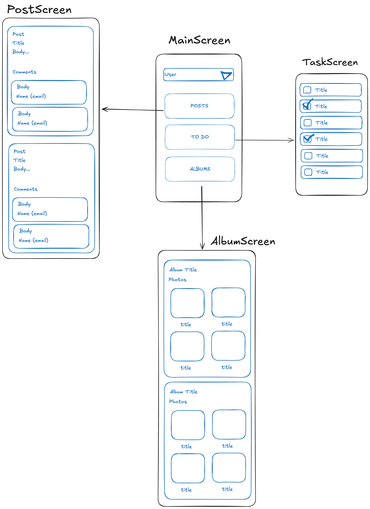

# Backend

## Sumário

- [Executar o projeto](#executar-o-projeto)
- [Rotas](#rotas)
- [Mockups](#mockups)

## Executar o projeto

```bash
npm install
npm run dev
```

## Rotas

### Usuários
- `GET /users` - Retorna todos os usuários

### Tarefas
- `GET /users/:userId/tasks` - Retorna todas as tarefas
- `POST /tasks` - Cria uma nova tarefa
- `PUT /tasks/:id` - Atualiza uma tarefa

### Álbuns
- `GET /users/:userId/albums` - Retorna todos os álbuns

### Publicações
- `GET /users/:userId/posts` - Retorna todas as publicações

## Mockups

