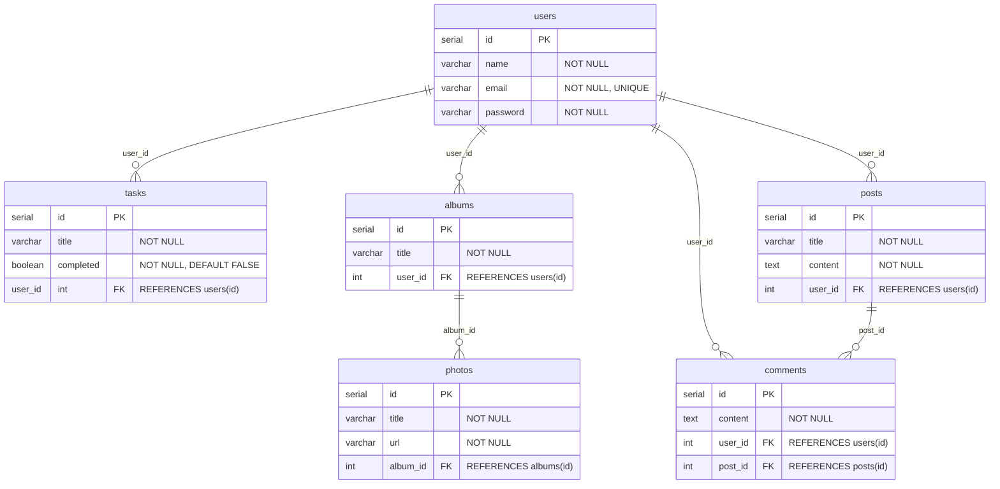

Esse é o código SQL para criar as tabelas do banco de dados
:
```SQL
CREATE TABLE users (
  id SERIAL PRIMARY KEY,
  name VARCHAR(255) NOT NULL,
  email VARCHAR(255) NOT NULL UNIQUE,
  password VARCHAR(255) NOT NULL
);

CREATE TABLE tasks (
  id SERIAL PRIMARY KEY,
  title VARCHAR(255) NOT NULL,
  completed BOOLEAN NOT NULL DEFAULT FALSE,
  user_id INT NOT NULL REFERENCES users(id)
);

CREATE TABLE albums (
  id SERIAL PRIMARY KEY,
  title VARCHAR(255) NOT NULL,
  user_id INT NOT NULL REFERENCES users(id)
);

CREATE TABLE photos (
  id SERIAL PRIMARY KEY,
  title VARCHAR(255) NOT NULL,
  url VARCHAR(255) NOT NULL,
  album_id INT NOT NULL REFERENCES albums(id)
);

CREATE TABLE posts (
  id SERIAL PRIMARY KEY,
  title VARCHAR(255) NOT NULL,
  content TEXT NOT NULL,
  user_id INT NOT NULL REFERENCES users(id)
);

CREATE TABLE comments (
  id SERIAL PRIMARY KEY,
  content TEXT NOT NULL,
  user_id INT NOT NULL REFERENCES users(id),
  post_id INT NOT NULL REFERENCES posts(id)
);
```